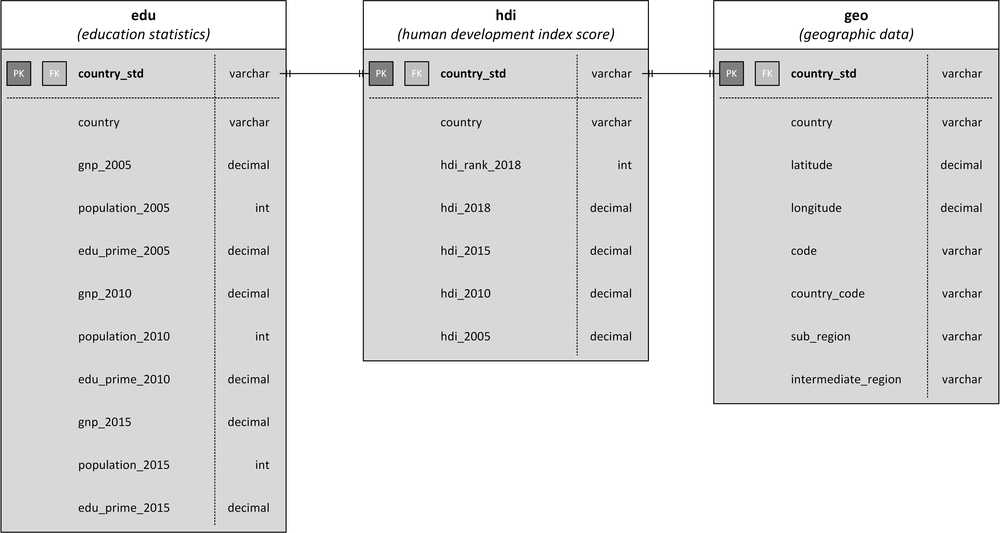

# ETL Project
### Creating a database of education and human development indicators

_Krystal Wang, Grant Sisson, Stephanie Hidalgo, Nathan Dieck_

## Introduction
Our group decided to produce a SQL database from four sources that would allow us to compare primary school graduation rates and overall levels of economic development across countries and regions of the world. The desired result was three tables using a standardized country name as a primary key in one database: one containing education data (primary school graduation rates), one with economic development data, and one with the geographic information that would allow us to sort and disaggregate data. Data could be used to compare basic education graduation rates and overall national development indicators and to potentially disaggregate them by regions of the world. 

To facilitate comparison, three ‘index years’ were selected for comparison. These years were 2015, 2010, and 2005. The three years were selected because they cover a reasonable span of time and because data after those years and before those years begin to thin out for many countries. 

## Extract
Four datasets were employed in this project. Data sources were:

_Geographic_
* https://developers.google.com/public-data/docs/canonical/countries_csv
* https://github.com/lukes/ISO-3166-Countries-with-Regional-Codes/blob/master/all/all.csv

_UN Human Development Index_
* http://hdr.undp.org/en/data

_World Bank Education Data_
* https://www.kaggle.com/ammon1/education-gnp-and-unemploynment#edu.csv

All the datasets came as .csv files which were read into a Jupyter notebook as pandas dataframes for Transformation. 

## Transform
In order to produce mutually compatible datasets all four of our source .csv files were transformed, sometimes extensively. 

### Geographic Data Transformation

Geographic data came from two separate sources:

Countries_geo.csv, a list of countries with latitude and longitude data 
Continent.csv, a list of countries that can be disaggregated by continents and regions they are in. 

We elected to combine these two topically related datasets into a single dataframe. To do so, we first dropped a redundant column, country code, from the geographic coordinates dataframe (countries_geo). The column ‘name’ was then changed to ‘country’ in order to facilitate the coming merge. We finally reorganized the columns in a more logical order: “country”, “latitude”, “longitude” , “code”, “country_code”, “sub_region” and “intermediate_region”, which is ready to be standardized and merged into other datasets.

With two geographic dataframes now organized with the compatible ‘country’ column, we performed an inner merge to produce df_geo, our completed geographic dataframe that would then be exported to Postgres. 

### HDI Data Transformation

The simplicity and organization of the Human Development Index dataset made it the easiest to work with. The most challenging aspect was the existence of regional summary data at the bottom of the csv file formatted as its own table; this break in the pattern made it impossible to import into a pandas dataframe until the extra unwanted data were removed by hand.

Our original intention was to reformat this dataset (which has countries as rows and years as columns) so that it matches our education dataset (which is organized by country, then year, as rows, and a variety of education indicators as columns). This employed pandas’ `df.melt()` function. However, this approach created a problem when establishing primary keys subsequently, so we chose instead to use the structure of the HDI dataframe and adjust the education data to match. This latter process was more complex but facilitated the establishment of primary keys when the data were exported to SQL.

The primary need when modifying the dataset was to drop superfluous data. There are columns in the dataset for every year from 1990 to 2018. All columns except our index years were dropped from the DataFrame. Additionally, because we discovered that SQL does not handle column names that begin with numbers, the year columns were renamed with a letter prefix (e.g. ‘2015’ became ‘hdi_2015’). 

### Education Data Transformation

The education dataset was perhaps the most challenging to transform due to its previously-described structure, with rows delineated first by country then by year. This structure proved intractable when `df.melt()` was attempted and required a workaround. Additionally, as with the HDI data above, a series of regionally aggregated statistics was provided. Unlike the HDI data, these were formatted correctly to import into the dataframe but still required removal. 

First, unwanted statistics were eliminated from the dataset. Statistics were usually removed because they were reported by a small number of usually wealthy countries or over a small number of years, which would preclude meaningful analysis. When this was complete, there were columns for country, calendar year, gross national product, population, and primary graduation rate. 

As a workaround to our inability to use df.melt to organize the data as desired, we pulled the data for each of our index years into its own dataframe and renamed the indicators in the dataframe by year (e.g. hdi became hdi_2015). When all three years were excised from the main dataframe, it was simple to merge them into a new object with the rows as countries and the columns as indicators by year. 

Finally the regional data lines were dropped as a side effect of establishing a primary key as discussed below. The result was a dataset compatible with the other two. 

### Establishing a Primary Key

We were interested primarily in country level data in our datasets, however our datasets provided us with two challenges:

First, several of our datasets contained regional aggregations (“Arab World”, “Sub Saharan Africa”, etc.) 
Second, the datasets have different country lists – they recognize different states (Palestinian Territories), use slightly different names for the same country (“Vatican City” vs. “Holy See”), or format the same name differently (“Korea, Democratic People’s Rep. of” and “Korea (Democratic People’s Republic of)”).

To make the countries comparable and to allow us to use the country name as a primary key, it became necessary to rename all the countries in our dataset so that each country was referenced by exactly the same name in each dataset. A column called ‘country_std’ was established in each dataset. 

We considered using a method where countries were put in alphabetical order but this seemed unreliable, time consuming, and technically challenging. We were then directed to the PyCountry module for Python, which features a ‘fuzzy search’ tool that can be referenced with Python code. In theory, the search tool would allow us to iterate through a ‘for’ loop in each dataset, enter whatever the country name in the dataset happened to be, and return the same, standardized name regardless. 

This worked in about 90% of cases however the ‘search’ tool turned out to be imperfect. It created a number of duplicate values (through mistakes, such as listing both Democratic Republic of the Congo and the Republic of Congo as ‘Congo’, or Niger as “Nigeria; or by including overseas holdings such as Mayotte or Curaçao with the name of the country that possesses them (Mayotte was listed as France and Curaçao as the Netherlands). Additionally, PyCountry could not produce a result for some country names (it can handle commas, but not parentheses, so the UNDP’s preference for the latter caused blank values to appear. The duplicates and the blanks made it impossible to use this system to generate a primary key without several workarounds. 

Code was written specifically referencing countries that produced duplicates (so Niger was forced to render as ‘Niger” and Curaçao was forced to render as “Curacao” rather than as “Netherlands”), a replace command was used to change parentheses to commas, and ultimately any countries that continued to produce blank values despite the workarounds were dropped from each dataset. The original datasets were not changed in this process. 

The result of this was three datasets, each with a list of countries using a standardized name. While the exact list of countries in each dataset is not identical, the ‘country_std’ variable can be used as a primary key for SQL joins and other purposes. Country_std was set as the index for all datasets. 

## Load 
Using psycopg2, the final datasets were exported to Postgres for evaluation and analysis. The database structure is as follows:

